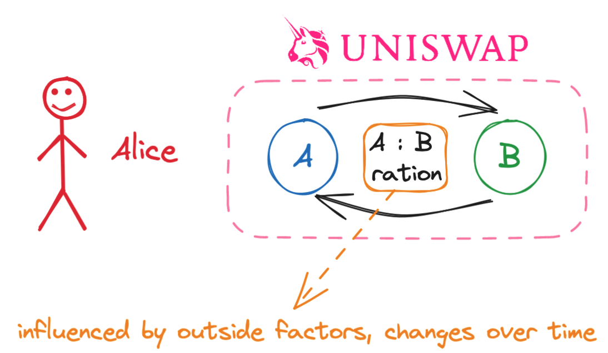
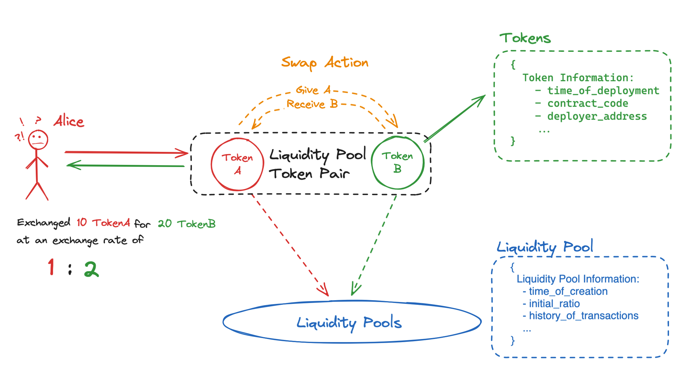

What are the **areas of interest** that DeFi Base would like to explore and how did we get to them? Areas of interest defined through the story.

<!-- truncate -->

## Introduction

Through examples and story, we shall define the **areas of interest, key components and concepts** that DeFi Base would want to explore.

## The Story

### Chapters
- [Chapter 1 - The Swaps](#chapter-1---the-swaps)
- [Chapter 2 - Outside Factors](#chapter-2---outside-factors)
- [Chapter 3 - Areas of Interest](#chapter-3---areas-of-interest)


---
---
### Chapter 1 - The Swaps

Meet **Alice**. Alice is relatively new to crypto & ethereum ecosystem. She has intent to **perform actions on the Ethereum network**. She understands the basics of blockchain, ethereum & EVM, into detail deep enough to allow her to perform basic swaps. 


She has intentions to **buy** tokens in order to achieve a certain **monetary gain**. Her desired place to do so is **Uniswap**. (note - in this case, tokens refer to ERC20 tokens)

To her current understanding, at a certain time, she can **swap TokenA for TokenB**, at a certain **exchange ratio**, calculated by an algorithm that is based on the **liquidity pool** of the given token pair.

Alice knows that other factors will influence the exchange ratio over time, such as **volume**, **liquidity**, **news**, **market sentiment** and many more. Her current goal is to achieve a certain **monetary gain** by swapping the tokens at a certain time, getting the best exchange ratio possible.




---
---
### Chapter 2 - Outside Factors

To her current understanding, Alice knows that the price on uniswap is automatically calculated by an [algorithm](https://support.uniswap.org/hc/en-us/articles/7422670207373-How-are-token-prices-determined-). 

Looking at the [picture from Chapter 1](../static/img/blog/areas-of-interest/2023-12-29-18-49-07.png), the ratio is calculated by the following formula: 

```
Token_A_supply * Token_B_supply = Constant
```

In which the buys and sells affect the **supply of tokens** in liquidity pool. **Constant needs to remain the same**, hence the exchange ratio between the tokens **changes** in order to keep the Constant the same.

Deducting from this, she realizes that the change in the **price of the token** depends on the constant, the **state of the liquidity pool - (the buys and the sells)**. She realizes that information she currently has **isn't sufficient** for her to achieve her goal, she needs to take a step back and think about what **affects the buys and sells**.

Alice realizes that in order to achieve her goal, she needs to have information.

*NOTE - One could argue that certain crypto markets could be deemed inefficient while others remain efficient. Here is a link to the* [Efficient-market hypothesis](https://en.wikipedia.org/wiki/Efficient-market_hypothesis)

#### Alice's obsession - the information she wants to know

In order to get a better understanding on what might happen, Alice would need to obtain certain information **about the token** she is interested in, as well as **the network** itself.

Alice became a bit scared realizing how much she doesn't know to the point where she became obsessed with the idea of **obtaining information before she makes a decision**.

While thinking about it, she came to the following conclusions.
- Alice wants to know the general information about the token, that would be a good starting point. **Wheres, whens, hows and whys**.
- Alice wants to know the current state of the token at the time of noticing it, as well as previous states that the token went through. She wants to know the **history** of the token.
- She, as everyone else, hopes that one day, she will be able to go back in time. Unfortunately, she knows that it is not possible, so **her best option is to guess:** "What would happen if she had done such and such"
- Alice knows that holders, buyers and sellers stand behind the token, other people's intentions are bringing value to it. She would want to somehow get to know the **people behind the token**.
- Noticing that people are sometimes **driven by the emotion instead of reason**, she would want to know how could that influence her actions & decisions.

As of now, in the context of our approach, **this is all that Alice wants to know**. Nothing else.

---
---
### Chapter 3 - Areas of Interest

Following Alice's trail of thought, we can use the following approach.

Defining what building blocks make Alice's line of thinking, we can start off small, with the **Swap Entity**.

The **Swap Entity** itself could be broken down into the following components:
- **Tokens** - red & green - The tokens that are being swapped, we could explore the swaps with multiple tokens (3 etc.)
- **Liquidity Pool** - blue - The liquidity pool that is being used for the swap
- **Swap Action** - organge - The action of swapping the tokens itself

The **Swap Entity** as shown in the image below.



We can say that the **Swap Entity** (Tokens, LPs and Swap Action) is the **core** of our journey and our **primary area of interest** as of now. Information originating from the sources of influence on the Swap Entity is also of interest. Being able to obtain such information would be of great help to Alice. That would be the **secondary area of interest - information gathering**. Taking a step away, and looking at the whole ethereum & defi ecosystem, we can say that the Swap Entity and it's components should be analized in bigger sample groups. That would define our **tertiary area of interest** -> Big Data collected over time.

Like every human being, Alice is also prone to curiosity. Being able to obtain & analyze such information and then reproduce it in a controlled environment, and being able to, with certain degree of certainty, predict the outcome, would be of great help to Alice. That would be the **quaternary area of interest - Simulations**.

To summarize:
- Swap Entity - swap action, tokens, liquidity pool etc.
- Information Gathering - information about the network, people, communities etc.
- Big Data - Monitoring the network, capturing tokens, indexing them etc.
- Simulations - Allows us to reproduce the outcomes of the mentioned 3 areas of interest.

More on these topics would be elaborated in the future articles.